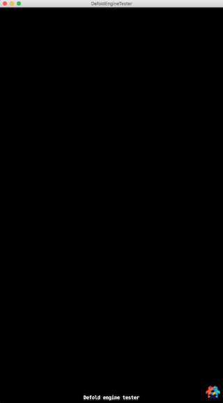

# defold-enginetester
This project runs Defold system/engine tests using the [Cucumber test framework](https://cucumber.io/).

# Requirements
You need the following tools installed:

* rbenv - Used to select the correct Ruby version when running tests
* Ruby 2.2.0 - Needed to run Cucumber
* Cucumber 1.3.18 - The test framework itself

## Installing rbenv
rbenv can be installed via brew:

	brew install rbenv

## Installing Ruby 2.2.0
Install the required Ruby version using rbenv:

	rbenv install 2.2.0

## Installing Cucumber
Cucumber is installed as a Ruby gem:

	gem install cucumber

# Running tests
Open the project in Defold and Build and Launch it. You should see the empty main collection:

The application is now ready to run tests. You run tests by launching cucumber from the command line. From the root of the project you start the tests like this:

	# Run all tests
	cucumber tester/features/

This will read all the `*.feature` files located in the specified folder. You can control which tests to run by specifying a specific feature file:

	# Run all tests in bunnymark.feature
	cucumber tester/features/bunnymark.feature

Another way to control which tests to run is to filter on tags instead:

	# Run all tests tagged with @sprite or @stress
	cucumber tester/features/ --tag @sprite --tag @stress
